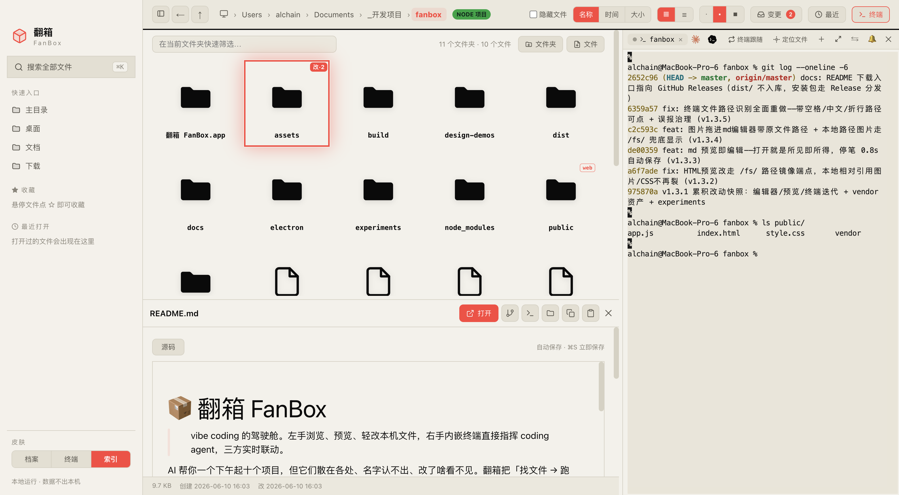

<div align="center">

# 📦 FanBox for Windows

> **FanBox — the cockpit for coding agents. Command Claude Code or Codex, watch every file and line they change, and take over anytime.**

</div>

<p align="center">
  
</p>

<div align="center">

[](LICENSE)
[](https://github.com/wxhBadUser/fanbox-master/releases/latest)
[](https://github.com/wxhBadUser/fanbox-master/releases/latest)
[](#architecture)

</div>

<br>

<div align="center">

**本地优先 · AI Coding Cockpit · Electron 桌面端**

<br>

本地文件浏览 · 内嵌终端 · Claude Code / Codex CLI · 微信 ClawBot 手机控制

<br>

所有 agent 调用发生在**用户本机**。

</div>

---

## FanBox for Windows — Windows Edition

本项目基于 [alchaincyf/fanbox](https://github.com/alchaincyf/fanbox) 修改而来，重点进行 **Windows 适配**：Windows 打包、node-pty 构建修复、Claude Code CLI 链路验证和微信 ClawBot Windows 运行验证。

原项目遵循 MIT License，本仓库保留原项目版权声明和许可条款。

> **macOS 用户请访问上游项目**[alchaincyf/fanbox](https://github.com/alchaincyf/fanbox)**。本仓库主要面向 Windows 平台。**

---

## Why FanBox · 为什么要做 FanBox

AI 帮你一个下午起十个项目，但它们散在各处、名字认不出、改了啥看不见。每天的真实流程是：文件管理器里翻半天 → 切到终端起 agent → 再切浏览器看效果，三个窗口来回跳。

FanBox 把这条链路收进一个窗口：**左边文件 × 右边/下边终端 × 原地预览**，一个有机整体。它不跟文件管理器拼文件操作，不跟 VS Code 拼编辑，专注「找回 + 预览 + 轻改 + 指挥 agent」这一条链路做到顺手。

**不做云、不做远程、不做账号。本地、零配置、运行时零依赖。**

---

## Windows 版已验证能力

- ✅ Windows exe 可启动（portable 免安装）
- ✅ Electron GUI 可正常打开
- ✅ node-pty Windows 构建和打包可用
- ✅ 内嵌终端可用（xterm.js + WebGL）
- ✅ Claude Code CLI 可识别和调用
- ✅ Codex CLI 可识别和调用
- ✅ OpenCode 入口（轻量，PATH 探测，未装时友好提示）
- ✅ Qoder CLI 入口（探测 `qoder` / `qodercli` / `qoder-cli`，未装时友好提示）
- ✅ bridge → driver → Claude 链路通过
- ✅ 微信 ClawBot 真实链路验证通过
- ✅ 手机微信消息可驱动 Windows 本机 Claude 回复
- ✅ 登录态持久化通过
- ✅ 打包版 exe 通过
- ✅ Claude / Codex 本地用量统计（不联网，仅读本地文件）
- ✅ Playwright 回归（35/35 通过）

## 使用前提

> ⚠️ **重要说明**

- **FanBox 不内置 Claude**。使用 Claude 功能需要用户本机自行安装并登录 [Claude Code CLI](https://docs.anthropic.com/en/docs/claude-code/overview)。
- 使用 Codex 功能需要用户本机自行安装 [Codex CLI](https://github.com/openai/codex)。
- OpenCode 与 Qoder CLI 为可选入口，需要用户本机自行安装对应 CLI；FanBox 不内置也不自动安装。
- 使用微信 ClawBot 需要用户**自己扫码登录**自己的微信账号。
- **FanBox 不上传、不托管、不分发用户微信/Claude/Codex 凭据**。所有数据存储在用户本机。

---

## 下载 & 安装

### 桌面版（推荐）

从 [GitHub Releases](https://github.com/wxhBadUser/fanbox-master/releases/latest) 下载 `FanBox 2.3.0.exe`，双击运行。

> ⚠️ 当前 Windows 构建**未签名**。首次运行可能出现 Windows SmartScreen 提示。
>
> 解决方法：点击「更多信息 (More info)」→「仍要运行 (Run anyway)」。
>
> 内置更新提醒：检测到 GitHub 上有新 Release 时，右下角会弹提示，不强更、可对单个版本「不再提醒」。

### 源码运行

```bash
npm install
npm run rebuild      # 构建 node-pty 原生模块
npm run verify:build  # 验证构建
npm run verify:paths  # 验证路径
npm run app           # 启动 FanBox
```

### 打包

```bash
npm run dist:win      # 打包为 Windows portable exe（产物在 dist/ 目录）
```

> Windows 打包使用 `electron-builder --win`，产出为 portable exe。

---

## Windows 构建环境

推荐以下环境：

- Windows 10 或 Windows 11
- [Node.js](https://nodejs.org/) 22 LTS 或更新版本
- npm（随 Node.js 安装）
- [Python 3.11+](https://www.python.org/downloads/)
- [Visual Studio Build Tools 2022](https://visualstudio.microsoft.com/downloads/#build-tools-for-visual-studio-2022)
  - 工作负载：**Desktop development with C++**
  - 组件：MSVC v143、Windows 10/11 SDK

> `npm run rebuild` 会调用 `node scripts/rebuild-win.js`，该脚本自动配置 node-pty 的 Windows 构建环境。

---

## 微信 ClawBot 使用说明

1. 启动 FanBox
2. 打开 ClawBot 面板
3. 点击「二维码登录」
4. 用自己的微信扫码
5. 选择 Claude target
6. 从手机发送消息即可驱动本机 Claude
7. 登录态保存在用户本机数据目录（`%APPDATA%/FanBox/wechat/` 或 `%APPDATA%/Electron/wechat/`）

> 首次连接需要扫码授权。后续启动自动恢复连接（只要 token 未过期）。

---

## Three skins · 三套皮肤

界面在 [huashu-design](https://github.com/wxhBadUser/huashu-design) 辅助下完成设计。三套皮肤不是换个主题色——配色、字体、图标、代码高亮、终端 ANSI 主题整体随之变化。

| | |
|---|---|
|  | **终端 · Volt** · 荧光绿 × 炭黑 × 等宽字，工业仪器面板感（默认） |
|  | **档案 · Archive** · 奶油纸 × 赤陶橙 × 衬线，温暖纸感档案馆 |
|  | **索引 · Index** · 黑白 × 信号红/绿 × 巨号字，编辑式索引日报 |

---

## 数据与隐私

- **本地优先**：所有数据存储在本机，不上传云端。
- **不上传 Claude/Codex/微信凭据**：凭据仅在用户本机用于 API 调用。
- **不内置任何账号**：FanBox 不要求注册或登录。
- **不内置任何 API key、token、cookie**：所有 CLI 凭据由用户各自 CLI 自行管理。
- **agent 调用发生在用户本机**：所有 Claude/Codex/OpenCode/Qoder 进程在用户本机运行。
- **不读取、不上传、不分发用户文件**：FanBox 只在你的本机读写文件。
- **不上传截图**：截图面板内容仅留在本机；不外发。
- **不上传 Claude/Codex 本地记录**：用量统计只读本地文件，不联网（Claude 限额查询只发往 `api.anthropic.com` 用于 `/usage` 同源数据）。
- **回收站删除不是永久删除**：删除到回收站后文件仍可恢复；永久删除请用资源管理器。
- **验证脚本使用 `.tmp/verify-wechat/` 隔离目录**：不读写真实 account。
- **不要提交 `account.json`、`config.json`、logs、recordings、`dist/`、`node_modules/`** 到版本控制。

---

## 快捷键

| 操作 | 键 |
|---|---|
| 全局搜索 | `Ctrl+K` |
| 用编辑器打开 | `Ctrl+Enter` |
| 折叠侧栏 | `Ctrl+B` |
| 后退 | `Ctrl+[` |
| 当前目录筛选 | `/` |
| 打开/预览 | `Enter` |
| 结果上下选择 | `↑` `↓` |
| 关闭 | `Esc` |

> Windows 快捷键已适配 Ctrl 代替 ⌘。

---

## 常见问题

### Electron 被当成 Node 启动

如果运行 `npm run app` 后只显示 Node 终端而没有窗口，请确保 Electron 已正确安装：

```bash
npm install
npx electron --version
```

### node-pty rebuild 失败

确保已安装 Visual Studio Build Tools 2022，然后运行：

```bash
npm run rebuild
```

如果仍然失败，检查：

- Python 3.11+ 是否在 PATH 中
- MSVC v143 是否安装
- Windows 10/11 SDK 是否安装

### Claude 找不到

确保已安装 Claude Code CLI：

```bash
npm install -g @anthropic-ai/claude-code
claude --version
```

### Codex 未安装

FanBox 会在 Codex 未安装时优雅降级，不报错。Claude 链路仍然正常工作。

### Windows SmartScreen 提示

当前构建未签名。点击「更多信息」→「仍要运行」。

### 打包版无法打开

请确保：

1. Windows 10 或更高版本（不支持 Windows 7/8）
2. 没有安全软件拦截
3. 尝试以管理员身份运行

### 微信二维码无法登录

1. 确保本机网络可以访问微信服务器
2. 二维码有时效性，过期后点击重新生成
3. 检查 ClawBot 面板连接状态

---

## 当前限制

- **Codex 完整链路尚未验证**：当前 Windows 版主要验证了 Claude 链路，Codex 完整端到端测试仍在进行中。
- **Windows 搜索/缩略图/防休眠/截图直通车仍在完善**：部分功能（全文搜索、缩略图缓存、防休眠、截图直通）尚在适配中。
- **安装包未签名**：当前 Windows 构建为未签名 portable exe。
- **Windows 版目前是 MVP**：功能稳定但还有完善空间。
- **macOS 原功能不保证全部已在 Windows 等价实现**：部分 macOS 特有功能尚未移植。

---

## Roadmap

- [x] Windows 路径治理
- [x] Windows node-pty 构建
- [x] Windows exe 打包
- [x] Claude Code CLI Windows 链路验证
- [x] 微信 ClawBot Windows 运行验证
- [ ] Codex Windows 链路验证
- [ ] Windows 搜索适配
- [ ] Windows 缩略图适配
- [ ] Windows 截图直通车
- [ ] Windows 防休眠
- [ ] 安装体验优化（签名、安装向导）
- [ ] 签名/发布流程
- [ ] 自动更新

---

## Architecture · 技术架构

| 层 | 技术 |
|---|---|
| 后端 | 零依赖 Node.js `server.js`（文件 API + 静态服务 + 缩略图） |
| 桌面壳 | Electron 33 + node-pty（asarUnpack 原生模块） |
| 终端 | xterm.js + WebGL + unicode11 |
| 编辑器 | Monaco（代码）+ Milkdown Crepe（Markdown） |
| 打包 | electron-builder → Windows portable exe |

```
fanbox/
├── server.js               # 零依赖 Node 后端
├── electron/
│   ├── main.js             # 主进程（窗口/pty/剪贴板/菜单）
│   ├── preload.js          # 暴露 fanboxPty / fanboxFs / fanboxClipboard
│   ├── atomic-json.js      # 原子 JSON 读写
│   └── wechat/
│       ├── bridge.js       # 微信 ClawBot 桥接
│       ├── driver.js       # Claude/Codex driver
│       ├── ilink.js        # iLink 协议
│       └── memory.js       # 微信记忆
├── public/
│   ├── index.html
│   ├── style.css
│   ├── app.js              # 前端单页应用
│   └── vendor/             # xterm / monaco / milkdown 本地资源
├── scripts/
│   ├── rebuild-win.js      # Windows node-pty 构建
│   ├── verify-windows-build.js
│   ├── verify-paths.js
│   ├── verify-wechat-bridge.js
│   └── run-app.js
├── build/                  # 图标 + entitlements
├── docs/                   # 设计文档
└── experiments/            # 实验脚本
```

---

## Standing on the shoulders of giants · 建在巨人肩膀上

FanBox 的核心能力来自这些出色的开源项目：

| 项目 | 用在哪 | License |
|---|---|---|
| [Electron](https://www.electronjs.org/) | 桌面壳 | MIT |
| [node-pty](https://github.com/microsoft/node-pty) | 伪终端 | MIT |
| [xterm.js](https://xtermjs.org/) | 终端渲染 | MIT |
| [Monaco Editor](https://microsoft.github.io/monaco-editor/) | 代码/JSON 编辑与 Git diff | MIT |
| [Milkdown](https://milkdown.dev/) (Crepe) | Markdown 所见即所得编辑 | MIT |
| [marked](https://marked.js.org/) | Markdown 预览渲染 | MIT |
| [highlight.js](https://highlightjs.org/) | 代码语法高亮 | BSD-3-Clause |
| [esbuild](https://esbuild.github.io/) | 前端 vendor 打包 | MIT |
| [electron-builder](https://www.electron.build/) | 打包 exe | MIT |
| [Playwright](https://playwright.dev/) | UI 验证截图 | Apache-2.0 |

---

## Credits · 致谢

本项目基于 [alchaincyf/fanbox](https://github.com/alchaincyf/fanbox) 修改而来。

感谢原作者花叔（Huashu）和原项目提供的 FanBox 设计与实现。本仓库主要聚焦 **Windows 适配**、Windows 构建、Claude Code CLI 链路验证和微信 ClawBot Windows 运行验证。

界面设计在 [huashu-design](https://github.com/wxhBadUser/huashu-design) 辅助下完成。

## Author · 关于原作者

**花叔 Huashu** — AI Native Coder，独立开发者。代表作：小猫补光灯（App Store 付费榜 Top1）。

---

## About Me · 关于作者

**wxh** — 中国科学技术大学（USTC）在读博士生，方向是深度学习图像处理、大模型开发与 AI Agent 应用。

做 FanBox 的初衷很简单：每天在文件管理器、终端、浏览器之间来回切太累了，想做一个把所有 agent 工作流收进一个窗口的工具。选择了 Fork 而非从零造轮子，因为花叔的 FanBox 已经有很好的设计基底，我主要做 Windows 适配和链路验证。

项目还在早期，我本人科研任务也比较重，更新可能不会很快。但只要有空就会继续完善，也欢迎大家提 Issue 和 PR，一起让这个工具变得更好用。

如果这个项目对你有帮助，**点个 Star ⭐** 就是最大的鼓励。感谢关注！

## 免责声明

本人时间有限，维护和更新主要靠业余时间，更新节奏可能较慢，望见谅。项目目前处于 MVP 阶段，功能稳定但仍有不完善之处。欢迎各位大佬提交 PR 共同改进，我会尽快 review 和合并。

---

## License

This project is licensed under the MIT License. See [LICENSE](LICENSE).

---

## Public Release Checklist

> 用于把本仓库以 **「FanBox Windows Edition」** 的身份发布到 GitHub 时的清单。
> 详见 `docs/release-windows-mvp.md`。

- [ ] `git status` 干净，工作树无未提交改动
- [ ] `npm run verify:paths` / `verify:build` / `verify-agent-driver` / `verify-wechat-bridge` 全部通过
- [ ] `npm run test:e2e:windows` 35/35 通过
- [ ] 确认无 `account.json` / `config.json` / `.env` / `*.log` / `dist/` / `node_modules` 误入暂存
- [ ] 在 GitHub 创建空仓库（**不要**用「Initialize with README」勾选，本仓库已有 README）
- [ ] `git remote add origin <new-repo-url>` 后 `git push -u origin master`
- [ ] 打 tag `v2.4.0-windows` 并 push
- [ ] 在 GitHub Releases 上传 `FanBox 2.4.0.exe`（`npm run dist:win` 产物，**不入 repo**）
- [ ] Release Notes 见 `docs/release-windows-mvp.md` 末段模板